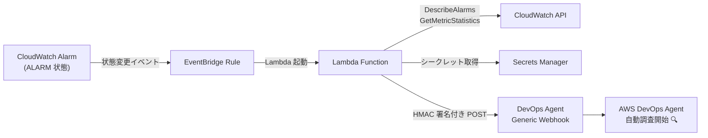

# CloudWatch アラームから AWS DevOps Agent を自動起動する Webhook 連携の仕組み

## はじめに

「本番環境でアラームが鳴ったけど、原因調査に時間がかかる…」

運用の現場では、CloudWatch アラームが発報してからエンジニアが調査を開始するまでにタイムラグが生じがちです。特に深夜帯や休日のオンコール対応では、初動の遅れがサービス影響の拡大に直結します。

この記事では、CloudWatch アラームの発報をトリガーに **AWS DevOps Agent の調査を自動起動する仕組み** を、CloudFormation テンプレート一発でデプロイする方法を紹介します。

本記事の CloudFormation テンプレートとアーキテクチャは、[AWS DevOps Agent Workshop の Webhook Integration ラボ](https://catalog.us-east-1.prod.workshops.aws/workshops/767d3081-b4fa-4e08-81da-17e5c94a1a08/en-US/04-containerized-app-failures/40-webhook-integration) をベースにしています。ワークショップでは EKS 環境での実践的なハンズオンが体験できるので、実際に手を動かして試したい方はそちらもぜひ参照してください。

## この記事で得られること

- CloudWatch → EventBridge → Lambda → DevOps Agent Webhook の連携アーキテクチャ
- HMAC-SHA256 による Webhook 署名の実装方法
- タグベースのフィルタリングと優先度マッピング
- CloudFormation によるワンクリックデプロイ手順

## 全体アーキテクチャ



処理の流れは以下のとおりです。

1. CloudWatch アラームが **ALARM** 状態に遷移する
2. EventBridge ルールがその状態変更イベントをキャッチする
3. Lambda 関数が起動し、アラームの詳細情報とメトリクスデータを収集する
4. 収集した情報をインシデントペイロードに整形する
5. HMAC-SHA256 で署名し、DevOps Agent の Generic Webhook に POST する
6. DevOps Agent が AI ベースの自動調査を開始する

## なぜ Webhook 連携なのか

AWS DevOps Agent には Generic Webhook エンドポイントが用意されています。この Webhook を使うことで、任意の監視ソースからインシデントを作成し、AI による自動調査をトリガーできます。

CloudWatch アラームと直接統合するのではなく、EventBridge + Lambda を間に挟むことで以下のメリットがあります。

- **アラーム情報の enrichment（情報付加）**: アラーム設定、タグ、直近のメトリクスデータを付与できる
- **フィルタリング**: 特定のタグが付いたアラームだけを対象にできる
- **優先度マッピング**: 環境タグに応じた優先度を自動設定できる
- **セキュアな認証**: Secrets Manager + HMAC 署名で安全に通信できる

## タグを付けるだけで自動調査対象にできる — このアーキテクチャ最大のメリット

この仕組みの核心は、**既存の CloudWatch アラームにタグを 1 つ追加するだけで、AI による自動調査の対象にできる** という点です。

```bash
aws cloudwatch tag-resource \
  --resource-arn arn:aws:cloudwatch:us-east-1:123456789012:alarm:MyAlarm \
  --tags Key=auto_investigate,Value=true
```

たったこれだけで、そのアラームが発報した瞬間に DevOps Agent が自動で調査を開始します。逆に、タグを外せば即座に対象外になります。

### なぜこの設計が優れているのか

従来のインシデント自動化では、「どのアラームを自動対応の対象にするか」を EventBridge ルールのフィルタパターンや Lambda のコード内にハードコードしがちでした。この方法には以下の問題があります。

- アラームを追加・除外するたびにインフラコードの変更とデプロイが必要
- 変更の反映にリードタイムが発生する
- 設定がコードに散在し、どのアラームが対象なのか一覧しにくい

タグベースのアプローチでは、これらの問題がすべて解消されます。

| 観点 | ハードコード方式 | タグベース方式（本アーキテクチャ） |
|---|---|---|
| 対象アラームの追加 | コード変更 + デプロイ | タグを付けるだけ |
| 対象アラームの除外 | コード変更 + デプロイ | タグを外すだけ |
| 反映までの時間 | デプロイパイプライン次第 | 即時 |
| 対象アラームの一覧性 | コードを読む必要あり | `aws cloudwatch list-tags-for-resource` で確認可能 |
| 権限の分離 | インフラ変更権限が必要 | CloudWatch タグ編集権限のみで OK |

### 段階的な導入が容易

この設計のもう一つの大きなメリットは、**段階的な導入が非常に簡単** なことです。

1. まず CloudFormation テンプレートをデプロイする（この時点ではどのアラームも自動調査の対象外）
2. 開発環境のアラームに `auto_investigate=true` タグを付けて動作確認する
3. 問題なければ UAT 環境、本番環境と順次タグを付けていく
4. 効果が薄いアラームはタグを外して対象から除外する

インフラの再デプロイなしに、運用チームの判断でリアルタイムに対象を調整できます。

### priority タグで優先度を直接指定

アラームに `priority` タグを付けることで、インシデントの優先度を直接指定できます。

```
Key: priority
Value: HIGH
```

DevOps Agent が受け付ける優先度は以下の 5 段階です。

| `priority` タグの値 | 意味 |
|---|---|
| `CRITICAL` | サービス全体に影響する重大障害 |
| `HIGH` | 主要機能に影響がある |
| `MEDIUM` | 一部機能に影響がある（デフォルト） |
| `LOW` | 影響は限定的 |
| `MINIMAL` | 情報レベル |

`priority` タグが未設定または不正な値の場合は `MEDIUM` がデフォルトとして使われます。環境（prod / staging / dev）ではなくアラームの性質に応じて優先度を設定できるため、同じ本番環境でも「決済系は CRITICAL、バッチ系は LOW」といった使い分けが可能です。

### アラームの Description を調査ヒントとして活用する

CloudWatch アラームには Description（説明）フィールドがあります。Lambda 関数は `DescribeAlarms` API でこの値を取得し、ペイロードの `data.cloudwatch.alarm.alarmDescription` として DevOps Agent に送信します。

つまり、**アラームの Description に調査のヒントや補足情報を書いておけば、DevOps Agent がそれを読んだ上で調査を開始** します。

```bash
aws cloudwatch put-metric-alarm \
  --alarm-name EC2-CPU-High \
  --alarm-description "このアラームはWebサーバー(EC2 i-0abc123)のCPU使用率を監視しています。
CPU高騰時はまずデプロイ履歴を確認してください。
直近のデプロイが原因の場合はロールバックを検討。
関連ログ: /var/log/nginx/error.log, /var/log/app/application.log
関連ダッシュボード: https://console.aws.amazon.com/cloudwatch/home#dashboards:name=WebServer
エスカレーション先: #infra-oncall (Slack)" \
  --metric-name CPUUtilization \
  --namespace AWS/EC2 \
  --statistic Average \
  --period 300 \
  --threshold 80 \
  --comparison-operator GreaterThanThreshold \
  --evaluation-periods 2 \
  --dimensions Name=InstanceId,Value=i-0abc123def456 \
  --alarm-actions arn:aws:sns:us-east-1:123456789012:my-topic
```

Description に書いておくと効果的な情報の例です。

| 情報 | 例 |
|---|---|
| 監視対象の役割 | 「決済処理を担当する ECS サービス」 |
| 調査の初手 | 「まず直近のデプロイ履歴を確認」 |
| 関連するログの場所 | `/var/log/app/application.log` |
| 関連ダッシュボードの URL | CloudWatch ダッシュボードへのリンク |
| 過去の障害パターン | 「月末にバッチ処理と重なって高騰することがある」 |
| エスカレーション先 | Slack チャンネルや PagerDuty サービス名 |

アラームの Description は AWS コンソールや CLI からいつでも更新できるため、運用ナレッジが蓄積されるたびに追記していくと、DevOps Agent の調査精度が継続的に向上します。

### 対象アラームの一覧確認

現在どのアラームが自動調査の対象になっているかは、AWS CLI で簡単に確認できます。

```bash
# 特定のアラームのタグを確認
aws cloudwatch list-tags-for-resource \
  --resource-arn arn:aws:cloudwatch:us-east-1:123456789012:alarm:MyAlarm

# AWS Resource Groups Tagging API で一括検索
aws resourcegroupstaggingapi get-resources \
  --tag-filters Key=auto_investigate,Values=true \
  --resource-type-filters cloudwatch:alarm
```

タグという AWS ネイティブの仕組みを使っているため、AWS Config や Resource Groups との統合も自然に行えます。

## 主要な機能の詳細

### アラーム情報の enrichment

Lambda 関数は、EventBridge から受け取ったイベントだけでなく、CloudWatch API を呼び出して以下の情報を追加で取得します。

- アラームの設定情報（閾値、評価期間、比較演算子など）
- アラームに付与されたタグ
- 直近のメトリクスデータポイント
- AWS アカウント ID とリージョン

これにより、DevOps Agent は調査に必要な十分なコンテキストを最初から持った状態で分析を開始できます。

## CloudFormation テンプレート（全文）

以下のテンプレートをファイルに保存し、そのままデプロイできます。`devops-agent-automatic-investigation-cloudwatch.yaml` として保存してください。

<details>
<summary>テンプレート全文を表示（クリックで展開）</summary>

```yaml
AWSTemplateFormatVersion: "2010-09-09"
Description: >
  CloudWatch MetricAlarm -> EventBridge -> Lambda -> AWS DevOps Agent Generic Webhook (HMAC).
  Stores webhook URL + secret in Secrets Manager, enriches alarm details (DescribeAlarms + GetMetricStatistics),
  filters by alarm tag auto_investigate=true, maps env->priority, signs payload using HMAC-SHA256, and POSTs to webhook.
  Includes robust fallback logic to derive alarmArn from event.resources[0] or from event.account/event.region + alarmName.

Parameters:
  SecretName:
    Type: String
    Default: devops-agent-webhook
    Description: Secrets Manager secret name to store webhookUrl and webhookSecret
  WebhookUrl:
    Type: String
    Description: Generic webhook URL (e.g., https://event-ai.us-east-1.api.aws/webhook/generic/...)
  WebhookSecret:
    Type: String
    NoEcho: true
    Description: Generic webhook secret key (HMAC secret)
  EnableOkStateNotifications:
    Type: String
    AllowedValues: ["true", "false"]
    Default: "false"
    Description: If true, also sends payload when alarm transitions to OK (action=resolved)

Resources:
  WebhookSecretStore:
    Type: AWS::SecretsManager::Secret
    Properties:
      Name: !Ref SecretName
      Description: Webhook configuration for AWS DevOps Agent generic webhook (HMAC)
      SecretString: !Sub |
        {
          "webhookUrl": "${WebhookUrl}",
          "webhookSecret": "${WebhookSecret}"
        }

  AlarmWebhookLambdaRole:
    Type: AWS::IAM::Role
    Properties:
      RoleName: !Sub "${AWS::StackName}-alarm-webhook-role"
      AssumeRolePolicyDocument:
        Version: "2012-10-17"
        Statement:
          - Effect: Allow
            Principal:
              Service: lambda.amazonaws.com
            Action: sts:AssumeRole
      ManagedPolicyArns:
        - arn:aws:iam::aws:policy/service-role/AWSLambdaBasicExecutionRole
      Policies:
        - PolicyName: AlarmWebhookInlinePolicy
          PolicyDocument:
            Version: "2012-10-17"
            Statement:
              - Sid: ReadSecret
                Effect: Allow
                Action:
                  - secretsmanager:GetSecretValue
                Resource: !Ref WebhookSecretStore
              - Sid: CloudWatchReads
                Effect: Allow
                Action:
                  - cloudwatch:DescribeAlarms
                  - cloudwatch:ListTagsForResource
                  - cloudwatch:GetMetricStatistics
                Resource: "*"
              - Sid: StsIdentity
                Effect: Allow
                Action:
                  - sts:GetCallerIdentity
                Resource: "*"

  AlarmWebhookLambda:
    Type: AWS::Lambda::Function
    Properties:
      FunctionName: !Sub "${AWS::StackName}-alarm-webhook"
      Runtime: nodejs18.x
      Handler: index.handler
      Role: !GetAtt AlarmWebhookLambdaRole.Arn
      Timeout: 30
      MemorySize: 256
      Environment:
        Variables:
          SECRET_ARN: !Ref WebhookSecretStore
          ENABLE_OK: !Ref EnableOkStateNotifications
      Code:
        ZipFile: |
          "use strict";

          const crypto = require("node:crypto");

          const { SecretsManagerClient, GetSecretValueCommand } = require("@aws-sdk/client-secrets-manager");
          const {
            CloudWatchClient,
            ListTagsForResourceCommand,
            DescribeAlarmsCommand,
            GetMetricStatisticsCommand
          } = require("@aws-sdk/client-cloudwatch");
          const { STSClient, GetCallerIdentityCommand } = require("@aws-sdk/client-sts");

          const secrets = new SecretsManagerClient({});
          const cw = new CloudWatchClient({});
          const sts = new STSClient({});

          const SECRET_ARN = process.env.SECRET_ARN;
          const ENABLE_OK = (process.env.ENABLE_OK || "false").toLowerCase() === "true";

          function tagsToMap(tagsArray) {
            const out = {};
            for (const t of tagsArray || []) out[t.Key] = t.Value;
            return out;
          }

          const VALID_PRIORITIES = new Set(["CRITICAL", "HIGH", "MEDIUM", "LOW", "MINIMAL"]);

          function resolvePriority(raw) {
            const v = (raw || "").toUpperCase();
            return VALID_PRIORITIES.has(v) ? v : "MEDIUM";
          }

          function toIso(d) {
            try {
              return d ? new Date(d).toISOString() : null;
            } catch {
              return null;
            }
          }

          function pickLatestDatapoint(datapoints, statistic, extendedStatistic) {
            if (!Array.isArray(datapoints) || datapoints.length === 0) return null;
            const sorted = [...datapoints].sort((a, b) => new Date(b.Timestamp).getTime() - new Date(a.Timestamp).getTime());
            const dp = sorted[0];

            if (statistic) {
              return { timestamp: toIso(dp.Timestamp), value: dp[statistic] ?? null, unit: dp.Unit ?? null };
            }
            if (extendedStatistic) {
              const v = dp.ExtendedStatistics?.[extendedStatistic] ?? null;
              return { timestamp: toIso(dp.Timestamp), value: v, unit: dp.Unit ?? null, extendedStatistic };
            }
            return null;
          }

          exports.handler = async (event) => {
            const detail = event?.detail || {};
            const alarmName = detail.alarmName || detail.AlarmName || null;

            let alarmArn = detail.alarmArn || detail.AlarmArn || null;

            if (!alarmArn && Array.isArray(event?.resources) && event.resources[0]) {
              alarmArn = event.resources[0];
            }

            if (!alarmArn && alarmName && event?.account && event?.region) {
              alarmArn = `arn:aws:cloudwatch:${event.region}:${event.account}:alarm:${alarmName}`;
            }

            const stateValue = detail?.state?.value || detail?.StateValue || "ALARM";
            const previousStateValue = detail?.previousState?.value || null;

            if (stateValue === "OK" && !ENABLE_OK) {
              console.log("OK state ignored (ENABLE_OK=false).");
              return { skipped: true, reason: "ok_state_ignored" };
            }
            if (stateValue !== "ALARM" && stateValue !== "OK") {
              console.log("Non-ALARM/OK state ignored:", stateValue);
              return { skipped: true, reason: "state_not_supported", stateValue };
            }

            if (!alarmArn || !alarmName) {
              console.log("Missing alarmArn/alarmName; skipping.", { alarmArn, alarmName });
              return { skipped: true, reason: "missing_alarm_identity" };
            }

            const sec = await secrets.send(new GetSecretValueCommand({ SecretId: SECRET_ARN }));
            const secretObj = JSON.parse(sec.SecretString || "{}");
            const webhookUrl = secretObj.webhookUrl;
            const webhookSecret = secretObj.webhookSecret;

            if (!webhookUrl || !webhookSecret) {
              throw new Error("Secret is missing webhookUrl or webhookSecret");
            }
            if (!/^https?:\/\//.test(webhookUrl)) {
              throw new Error("Invalid webhookUrl in secret (must start with http/https).");
            }

            const tagResp = await cw.send(new ListTagsForResourceCommand({ ResourceARN: alarmArn }));
            const tags = tagsToMap(tagResp.Tags);

            const autoInvestigate = (tags.auto_investigate || "").toLowerCase() === "true";
            if (!autoInvestigate) {
              console.log("Skipping alarm (auto_investigate tag not true).", { alarmName, tags });
              return { skipped: true, reason: "auto_investigate_not_true" };
            }

            const priority = resolvePriority(tags.priority);

            const describe = await cw.send(new DescribeAlarmsCommand({ AlarmNames: [alarmName] }));
            const alarm = (describe.MetricAlarms || [])[0];
            if (!alarm) {
              console.log("DescribeAlarms returned no MetricAlarms for:", alarmName);
              return { skipped: true, reason: "alarm_not_found_or_no_access" };
            }

            const ident = await sts.send(new GetCallerIdentityCommand({}));
            const accountId = ident.Account || "unknown";

            const namespace = alarm.Namespace;
            const metricName = alarm.MetricName;
            const period = alarm.Period || 60;
            const statistic = alarm.Statistic;
            const extendedStatistic = alarm.ExtendedStatistic;
            const unit = alarm.Unit;

            const evalPeriods = alarm.EvaluationPeriods || 1;
            const bufferPeriods = Math.max(evalPeriods + 5, 10);

            const endTime = event?.time ? new Date(event.time) : new Date();
            const startTime = new Date(endTime.getTime() - bufferPeriods * period * 1000);

            let datapoints = [];
            let latest = null;

            try {
              const req = {
                Namespace: namespace,
                MetricName: metricName,
                Dimensions: alarm.Dimensions || [],
                StartTime: startTime,
                EndTime: endTime,
                Period: period,
              };
              if (statistic) req.Statistics = [statistic];
              if (extendedStatistic) req.ExtendedStatistics = [extendedStatistic];
              if (unit) req.Unit = unit;

              const stats = await cw.send(new GetMetricStatisticsCommand(req));
              datapoints = stats.Datapoints || [];
              latest = pickLatestDatapoint(datapoints, statistic, extendedStatistic);
            } catch (e) {
              console.log("GetMetricStatistics failed (continuing without observed values):", e?.message || e);
            }

            const stateReason = detail?.state?.reason || detail?.StateReason || "";
            const stateReasonData = detail?.state?.reasonData || null;
            const stateTime = event?.time ? new Date(event.time).toISOString() : new Date().toISOString();

            const action = stateValue === "ALARM" ? "created" : "resolved";
            const incidentId = `cw-${alarmName}-${Date.now()}`;

            const alarmRegion = event.region || process.env.AWS_REGION;
            const alarmDesc = alarm.AlarmDescription || "";

            // Build rich title and description so DevOps Agent has key context upfront
            const title = `${stateValue}: ${alarmName} (${alarmRegion})`;

            const descParts = [
              `Region: ${alarmRegion}`,
              `Account: ${accountId}`,
              `AlarmArn: ${alarmArn}`,
              `Namespace: ${namespace}`,
              `MetricName: ${metricName}`,
              `Threshold: ${alarm.ComparisonOperator} ${alarm.Threshold} (${statistic || extendedStatistic || "N/A"})`,
              `EvaluationPeriods: ${alarm.EvaluationPeriods}, Period: ${period}s`,
            ];
            if (alarmDesc) descParts.push(`AlarmDescription: ${alarmDesc}`);
            if (latest) descParts.push(`LatestValue: ${latest.value} (${latest.timestamp})`);
            descParts.push(`StateReason: ${stateReason}`);
            const description = descParts.join("\n");

            const payload = {
              eventType: "incident",
              incidentId,
              action,
              priority,
              title,
              description,
              timestamp: new Date().toISOString(),
              service: "CloudWatch",
              data: {
                metadata: {
                  region: alarmRegion,
                  environment: tags.env || tags.environment || "unknown",
                  accountId,
                },
                tags,
                cloudwatch: {
                  stateChange: {
                    alarmName,
                    alarmArn,
                    stateValue,
                    previousStateValue,
                    stateUpdatedTimestamp: stateTime,
                    reason: stateReason,
                    reasonData: stateReasonData,
                  },
                  alarm: {
                    alarmDescription: alarm.AlarmDescription,
                    actionsEnabled: alarm.ActionsEnabled,
                    alarmActions: alarm.AlarmActions,
                    okActions: alarm.OKActions,
                    insufficientDataActions: alarm.InsufficientDataActions,
                    comparisonOperator: alarm.ComparisonOperator,
                    threshold: alarm.Threshold,
                    evaluationPeriods: alarm.EvaluationPeriods,
                    datapointsToAlarm: alarm.DatapointsToAlarm,
                    treatMissingData: alarm.TreatMissingData,
                    unit: alarm.Unit,
                    period: alarm.Period,
                    statistic: alarm.Statistic,
                    extendedStatistic: alarm.ExtendedStatistic,
                    namespace: alarm.Namespace,
                    metricName: alarm.MetricName,
                    dimensions: alarm.Dimensions,
                  },
                  metric: {
                    namespace,
                    metricName,
                    statistic: statistic || null,
                    extendedStatistic: extendedStatistic || null,
                    period,
                    unit: unit || null,
                    dimensions: alarm.Dimensions || [],
                  },
                  observed: {
                    queryWindow: {
                      start: startTime.toISOString(),
                      end: endTime.toISOString(),
                      periodSeconds: period,
                    },
                    latest,
                    series: (datapoints || [])
                      .map((dp) => ({
                        timestamp: toIso(dp.Timestamp),
                        unit: dp.Unit ?? null,
                        average: dp.Average,
                        sum: dp.Sum,
                        minimum: dp.Minimum,
                        maximum: dp.Maximum,
                        sampleCount: dp.SampleCount,
                        extended: dp.ExtendedStatistics,
                      }))
                      .filter((x) => x.timestamp)
                      .sort((a, b) => new Date(a.timestamp).getTime() - new Date(b.timestamp).getTime()),
                  },
                  rawEventBridgeDetail: detail,
                },
              },
            };

            const sigTimestamp = new Date().toISOString();
            const body = JSON.stringify(payload);

            const hmac = crypto.createHmac("sha256", webhookSecret);
            hmac.update(`${sigTimestamp}:${body}`, "utf8");
            const signature = hmac.digest("base64");

            const resp = await fetch(webhookUrl, {
              method: "POST",
              headers: {
                "Content-Type": "application/json",
                "x-amzn-event-timestamp": sigTimestamp,
                "x-amzn-event-signature": signature,
              },
              body,
            });

            const respText = await resp.text();
            console.log("Webhook response:", resp.status, respText);
            return { ok: resp.ok, statusCode: resp.status, body: respText };
          };

  AlarmStateChangeRule:
    Type: AWS::Events::Rule
    Properties:
      Name: !Sub "${AWS::StackName}-cw-alarm-state-change"
      Description: Triggers Lambda on CloudWatch Alarm state changes (ALARM; OK handled by Lambda parameter)
      EventPattern:
        source:
          - aws.cloudwatch
        detail-type:
          - CloudWatch Alarm State Change
      State: ENABLED
      Targets:
        - Arn: !GetAtt AlarmWebhookLambda.Arn
          Id: AlarmWebhookLambdaTarget

  AllowEventBridgeInvokeLambda:
    Type: AWS::Lambda::Permission
    Properties:
      FunctionName: !Ref AlarmWebhookLambda
      Action: lambda:InvokeFunction
      Principal: events.amazonaws.com
      SourceArn: !GetAtt AlarmStateChangeRule.Arn

Outputs:
  SecretArn:
    Description: ARN of the Secrets Manager secret containing webhookUrl + webhookSecret
    Value: !Ref WebhookSecretStore
  LambdaArn:
    Description: Alarm webhook sender Lambda ARN
    Value: !GetAtt AlarmWebhookLambda.Arn
  EventRuleArn:
    Description: EventBridge rule ARN for alarm state changes
    Value: !GetAtt AlarmStateChangeRule.Arn
```

</details>

## CloudFormation テンプレートの解説

<!-- 📸 画像6: CloudFormation コンソールのスタック詳細画面 → Resources タブ。デプロイされた 5 つのリソース（Secret, Lambda, IAM Role, EventBridge Rule, Lambda Permission）が一覧表示されている状態 -->

テンプレートは以下の 5 つのリソースをデプロイします。

| リソース | 種類 | 役割 |
|---|---|---|
| `WebhookSecretStore` | Secrets Manager Secret | Webhook URL とシークレットキーを安全に保管 |
| `AlarmWebhookLambda` | Lambda Function | アラーム処理と Webhook 送信 |
| `AlarmWebhookLambdaRole` | IAM Role | Lambda に必要な最小権限を付与 |
| `AlarmStateChangeRule` | EventBridge Rule | CloudWatch アラームの状態変更をキャッチ |
| `AllowEventBridgeInvokeLambda` | Lambda Permission | EventBridge から Lambda の呼び出しを許可 |

### パラメータ

| パラメータ | デフォルト値 | 説明 |
|---|---|---|
| `SecretName` | `devops-agent-webhook` | Secrets Manager のシークレット名 |
| `WebhookUrl` | （必須） | DevOps Agent の Generic Webhook URL |
| `WebhookSecret` | （必須） | Webhook の HMAC シークレットキー |
| `EnableOkStateNotifications` | `false` | OK 状態への遷移時にも通知するか |

`EnableOkStateNotifications` を `true` にすると、アラームが解消（OK 状態に遷移）した際にも `action: "resolved"` としてペイロードを送信します。

### EventBridge ルール

EventBridge ルールは `aws.cloudwatch` ソースの `CloudWatch Alarm State Change` イベントをすべてキャッチし、Lambda に転送します。CloudWatch Alarm State Change イベントのペイロードにはアラームのタグ情報が含まれないため、EventBridge のイベントパターンでタグによるフィルタリングはできません。そのため、タグの確認（`auto_investigate=true`）は Lambda 側で `ListTagsForResource` API を呼び出して行っています。

## Lambda 関数の処理フロー

Lambda 関数の処理を順を追って見ていきます。

### 1. イベントの解析と ARN の取得

```javascript
const detail = event?.detail || {};
const alarmName = detail.alarmName || detail.AlarmName || null;
let alarmArn = detail.alarmArn || detail.AlarmArn || null;

// フォールバック 1: resources 配列から取得
if (!alarmArn && Array.isArray(event?.resources) && event.resources[0]) {
  alarmArn = event.resources[0];
}

// フォールバック 2: アカウント・リージョン・アラーム名から再構築
if (!alarmArn && alarmName && event?.account && event?.region) {
  alarmArn = `arn:aws:cloudwatch:${event.region}:${event.account}:alarm:${alarmName}`;
}
```

EventBridge イベントの形式にはバリエーションがあるため、複数のフォールバックロジックで ARN を確実に取得します。

### 2. 状態のフィルタリング

```javascript
const stateValue = detail?.state?.value || detail?.StateValue || "ALARM";

if (stateValue === "OK" && !ENABLE_OK) {
  return { skipped: true, reason: "ok_state_ignored" };
}
if (stateValue !== "ALARM" && stateValue !== "OK") {
  return { skipped: true, reason: "state_not_supported", stateValue };
}
```

ALARM 状態のみを処理対象とし、`ENABLE_OK` パラメータが有効な場合のみ OK 状態も処理します。`INSUFFICIENT_DATA` などの状態はスキップします。

### 3. タグの確認と優先度の決定

```javascript
const tagResp = await cw.send(
  new ListTagsForResourceCommand({ ResourceARN: alarmArn })
);
const tags = tagsToMap(tagResp.Tags);

const autoInvestigate = (tags.auto_investigate || "").toLowerCase() === "true";
if (!autoInvestigate) {
  return { skipped: true, reason: "auto_investigate_not_true" };
}

const priority = resolvePriority(tags.priority);
```

### 4. メトリクスデータの取得

```javascript
const endTime = event?.time ? new Date(event.time) : new Date();
const startTime = new Date(
  endTime.getTime() - bufferPeriods * period * 1000
);

const stats = await cw.send(new GetMetricStatisticsCommand(req));
```

アラーム発報前後のメトリクスデータを取得し、DevOps Agent に「何が起きていたか」の数値的な根拠を提供します。

### 5. HMAC-SHA256 署名と送信

```javascript
const sigTimestamp = new Date().toISOString();
const body = JSON.stringify(payload);

const hmac = crypto.createHmac("sha256", webhookSecret);
hmac.update(`${sigTimestamp}:${body}`, "utf8");
const signature = hmac.digest("base64");

const resp = await fetch(webhookUrl, {
  method: "POST",
  headers: {
    "Content-Type": "application/json",
    "x-amzn-event-timestamp": sigTimestamp,
    "x-amzn-event-signature": signature,
  },
  body,
});
```

署名は `タイムスタンプ:ペイロード` の形式で HMAC-SHA256 を計算し、Base64 エンコードしたものをヘッダーに付与します。これにより、Webhook エンドポイント側でリクエストの正当性を検証できます。

## Webhook ペイロードの構造

DevOps Agent に送信されるペイロードの例です。

```json
{
  "eventType": "incident",
  "incidentId": "cw-EC2-CPU-High-1700000000000",
  "action": "created",
  "priority": "HIGH",
  "title": "ALARM: EC2-CPU-High (us-east-1)",
  "description": "Region: us-east-1\nAccount: 123456789012\nAlarmArn: arn:aws:cloudwatch:us-east-1:123456789012:alarm:EC2-CPU-High\nNamespace: AWS/EC2\nMetricName: CPUUtilization\nThreshold: GreaterThanThreshold 80 (Average)\nEvaluationPeriods: 2, Period: 300s\nAlarmDescription: WebサーバーのCPU使用率監視\nLatestValue: 92.5 (2026-03-04T00:55:00Z)\nStateReason: Threshold Crossed: 1 out of 1 datapoints [92.5 (04/03/26 00:55:00)] was greater than the threshold (80.0).",
  "timestamp": "2026-03-04T01:00:00Z",
  "service": "CloudWatch",
  "data": {
    "metadata": {
      "region": "us-east-1",
      "environment": "prod",
      "accountId": "123456789012"
    },
    "tags": {
      "auto_investigate": "true",
      "priority": "HIGH"
    },
    "cloudwatch": {
      "stateChange": { "..." : "状態変更の詳細" },
      "alarm": { "..." : "アラーム設定の詳細" },
      "metric": { "..." : "メトリクス定義" },
      "observed": { "..." : "直近のデータポイント" }
    }
  }
}
```

`data.cloudwatch.observed` にはアラーム発報前後のメトリクス時系列データが含まれるため、DevOps Agent はトレンドの変化も含めて分析できます。

## デプロイ手順

### 前提条件

- AWS CLI がインストール・設定済みであること
- CloudFormation と IAM の操作権限があること
- AWS DevOps Agent のスペースが作成済みであること

### Step 1: Webhook URL とシークレットキーの取得

まず、DevOps Agent コンソールから Generic Webhook を作成し、URL とシークレットキーを取得します。

1. [AWS DevOps Agent コンソール](https://us-east-1.console.aws.amazon.com/aidevops/home?region=us-east-1) を開く
2. 対象のエージェントスペースを選択し、「View details」をクリック
3. 「Settings」→「Webhooks」に移動
4. 「Create webhook」から Generic Webhook を新規作成
5. 表示される以下の 2 つの値を控えておく
   - **Webhook URL**: `https://event-ai.us-east-1.api.aws/webhook/generic/...` の形式
   - **Webhook Secret**: HMAC 署名に使用するシークレットキー

<!-- 📸 画像1: DevOps Agent コンソールの Settings → Webhooks 画面。Generic Webhook の作成ボタンが見える状態 -->
<!-- 📸 画像2: Webhook 作成後の画面。Webhook URL と Webhook Secret が表示されている状態（シークレットはマスク処理すること） -->

> ⚠️ Webhook Secret は作成時にしか表示されません。必ずこのタイミングで安全な場所に保存してください。

詳細な手順は [AWS DevOps Agent Workshop - Webhook Integration](https://catalog.us-east-1.prod.workshops.aws/workshops/767d3081-b4fa-4e08-81da-17e5c94a1a08/en-US/04-containerized-app-failures/40-webhook-integration) も参考にしてください。

### Step 2: スタックのデプロイ

Step 1 で取得した Webhook URL とシークレットキーをパラメータに指定してデプロイします。

以下のコマンドで `YOUR_WEBHOOK_ID` と `YOUR_WEBHOOK_SECRET` の 2 箇所を、Step 1 で控えた値に置き換えてください。それ以外はそのまま実行できます。

テンプレートファイルをローカルに保存済みの場合：

```bash
aws cloudformation deploy \
  --template-file devops-agent-automatic-investigation-cloudwatch.yaml \
  --stack-name devops-agent-alarm-integration \
  --capabilities CAPABILITY_NAMED_IAM \
  --parameter-overrides \
    WebhookUrl=https://event-ai.us-east-1.api.aws/webhook/generic/YOUR_WEBHOOK_ID \
    WebhookSecret=YOUR_WEBHOOK_SECRET
```

CloudShell から直接実行する場合は、GitHub からテンプレートをダウンロードしてそのままデプロイできます：

```bash
curl -O https://raw.githubusercontent.com/hibira/tech-blog/main/devops-agent-webhook/devops-agent-automatic-investigation-cloudwatch.yaml

aws cloudformation deploy \
  --template-file devops-agent-automatic-investigation-cloudwatch.yaml \
  --stack-name devops-agent-alarm-integration \
  --capabilities CAPABILITY_NAMED_IAM \
  --parameter-overrides \
    WebhookUrl=https://event-ai.us-east-1.api.aws/webhook/generic/YOUR_WEBHOOK_ID \
    WebhookSecret=YOUR_WEBHOOK_SECRET
```

| 置き換え箇所 | 置き換える値 |
|---|---|
| `YOUR_WEBHOOK_ID` | Step 1 で取得した Webhook URL のパス末尾の ID |
| `YOUR_WEBHOOK_SECRET` | Step 1 で取得した Webhook Secret |

OK 状態の通知も有効にする場合は、パラメータを追加します。

```bash
    EnableOkStateNotifications=true
```

### Step 3: アラームへのタグ付け

自動調査の対象にしたいアラームにタグを付与します。以下の例では `YOUR_ALARM_ARN` を対象アラームの ARN に置き換えてください。

```bash
# 例: arn:aws:cloudwatch:us-east-1:123456789012:alarm:EC2-CPU-High
aws cloudwatch tag-resource \
  --resource-arn YOUR_ALARM_ARN \
  --tags Key=auto_investigate,Value=true Key=priority,Value=HIGH
```

<!-- 📸 画像5: CloudWatch コンソールのアラーム詳細画面 → Tags タブ。auto_investigate=true と priority=HIGH のタグが付与されている状態 -->

> 💡 既にスタックがデプロイ済みで、Webhook URL やシークレットキーだけを更新したい場合は、Secrets Manager を直接更新できます。
>
> ```bash
> aws secretsmanager update-secret \
>   --secret-id devops-agent-webhook \
>   --secret-string '{"webhookUrl":"YOUR_NEW_WEBHOOK_URL","webhookSecret":"YOUR_NEW_WEBHOOK_SECRET"}'
> ```

## 動作確認

AWS CLI でアラーム状態を手動で変更して、一連のフローをテストできます。`YOUR_ALARM_NAME` を Step 3 でタグを付けたアラーム名に置き換えてください。

```bash
aws cloudwatch set-alarm-state \
  --alarm-name YOUR_ALARM_NAME \
  --state-value ALARM \
  --state-reason "Manual test for DevOps Agent integration"
```

Lambda の実行ログは CloudWatch Logs で確認できます。ロググループ名はスタック名に応じて変わります。

```bash
# デフォルトのスタック名 devops-agent-alarm-integration の場合
aws logs tail /aws/lambda/devops-agent-alarm-integration-alarm-webhook --follow
```

正常に動作していれば、ログに以下のような出力が表示されます。

```
Webhook response: 200 {"message":"Event received"}
```

<!-- 📸 画像3: CloudWatch Logs コンソールで Lambda の実行ログを表示した画面。「Webhook response: 200」の行がハイライトされている状態 -->
<!-- 📸 画像4: DevOps Agent コンソールの Incident Response 画面。Webhook 経由で自動作成されたインシデントと、AI による調査が開始されている状態 -->

## セキュリティ上の考慮事項

### なぜ Secrets Manager を使うのか

<!-- 📸 画像7: Secrets Manager コンソールで devops-agent-webhook シークレットの詳細画面。Secret value が「Retrieve secret value」ボタンで隠されている状態（IAM で制御されていることが伝わる） -->

Webhook の URL とシークレットキーは、Lambda の環境変数ではなく Secrets Manager に保管しています。

Lambda の環境変数にシークレットを直接入れる方法は手軽ですが、以下のリスクがあります。

- AWS コンソールの Lambda 設定画面から**誰でも平文で閲覧できてしまう**
- CloudFormation テンプレートの変更履歴やスタックイベントに値が残る可能性がある
- 環境変数の値は Lambda のデプロイパッケージに含まれるため、意図しない経路で漏洩するリスクがある

Secrets Manager を使うことで、これらの問題を回避できます。

- シークレットへのアクセスは **IAM ポリシーで制御** される
- Lambda は実行時に `GetSecretValue` API で取得するため、設定画面には表示されない
- CloudTrail でシークレットへのアクセス履歴を監査できる
- シークレットのローテーションにも対応可能

本テンプレートでは、CloudFormation のデプロイ時にパラメータとして渡された Webhook URL とシークレットキーを Secrets Manager に格納し、Lambda は実行時に ARN を使って取得します。

```javascript
// Lambda 内でのシークレット取得
const sec = await secrets.send(
  new GetSecretValueCommand({ SecretId: SECRET_ARN })
);
const secretObj = JSON.parse(sec.SecretString || "{}");
const webhookUrl = secretObj.webhookUrl;
const webhookSecret = secretObj.webhookSecret;
```

### その他のセキュリティベストプラクティス

- **HMAC 署名**: リクエストの改ざん防止とリプレイ攻撃対策としてタイムスタンプ付きの HMAC-SHA256 署名を使用
- **最小権限の原則**: Lambda の IAM ロールには必要最小限の権限のみを付与
- **NoEcho パラメータ**: CloudFormation のパラメータで `NoEcho: true` を指定し、シークレットがコンソールに表示されないようにする

## トラブルシューティング

| 症状 | 原因 | 対処法 |
|---|---|---|
| Lambda が起動しない | EventBridge ルールが無効 | コンソールでルールの State が ENABLED か確認 |
| Lambda は起動するが調査が始まらない | `auto_investigate` タグが未設定 | アラームにタグを付与する |
| Webhook が 401 を返す | HMAC シークレットの不一致 | Secrets Manager の値と DevOps Agent 側の設定を照合 |
| Webhook が 404 を返す | Webhook URL が不正 | URL のパスとリージョンを確認 |
| 重複インシデントが作成される | 想定どおりの動作 | DevOps Agent 側で `incidentId` による重複排除が行われる |

## まとめ

この記事で紹介したアーキテクチャの最大のポイントは、**CloudWatch アラームにタグを付けるだけで AI 自動調査の対象にできる** という運用のシンプルさです。

- インフラの再デプロイは不要
- 対象アラームの追加・除外はタグ操作だけで即時反映
- 環境タグで優先度も自動決定

CloudFormation テンプレートを一度デプロイすれば、あとは運用チームがタグを付け外しするだけで自動調査の範囲をコントロールできます。まずは開発環境のアラームから `auto_investigate=true` を付けて試してみてください。

## 参考リンク

- [AWS DevOps Agent Workshop - Webhook Integration](https://catalog.us-east-1.prod.workshops.aws/workshops/767d3081-b4fa-4e08-81da-17e5c94a1a08/en-US/04-containerized-app-failures/40-webhook-integration) 
- [AWS DevOps Agent ドキュメント](https://docs.aws.amazon.com/devops-agent/)
- [Amazon EventBridge ユーザーガイド](https://docs.aws.amazon.com/eventbridge/latest/userguide/)
- [CloudWatch アラームの状態変更イベント](https://docs.aws.amazon.com/AmazonCloudWatch/latest/monitoring/cloudwatch-and-eventbridge.html)
- [AWS Secrets Manager ユーザーガイド](https://docs.aws.amazon.com/secretsmanager/latest/userguide/)
